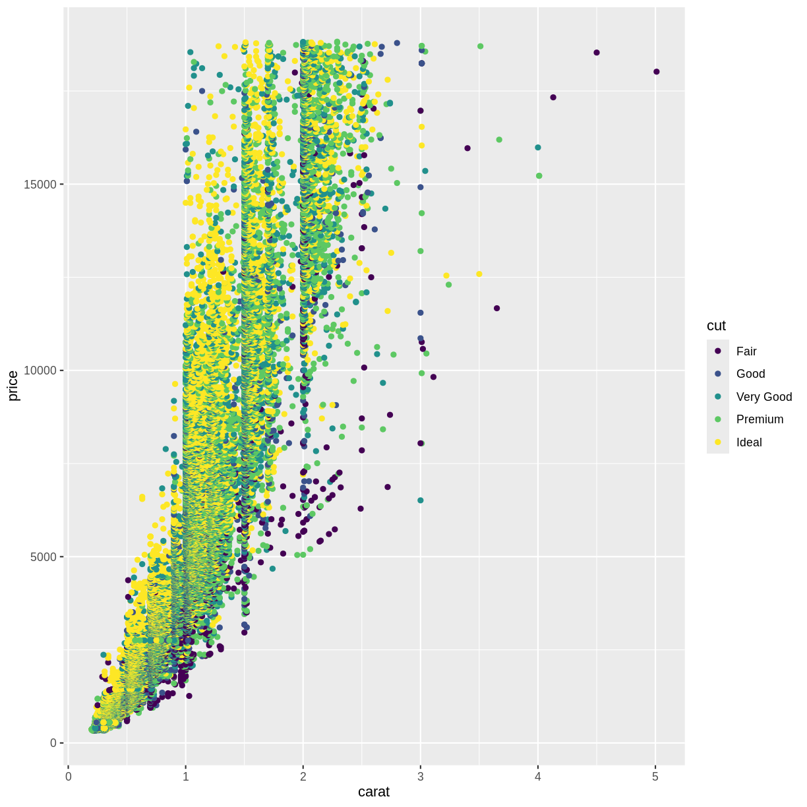

---
# Please do not edit this file directly; it is auto generated.
# Instead, please edit 05-rmarkdown-example.md in _episodes_rmd/
source: Rmd
title: "Using RMarkdown"
teaching: 10
exercises: 2
questions:
- "How do I write a lesson using RMarkdown?"
objectives:
- "Explain how to use RMarkdown with the new lesson template."
- "Demonstrate how to include pieces of code, figures, and challenges."
keypoints:
- "Edit the .Rmd files not the .md files"
- "Run `make serve` to knit documents and preview lesson website locally"
---


This episode demonstrates all the features that can be used when writing a
lesson in [RMarkdown][r-markdown].

When rendering a lesson written in RMarkdown, the lesson template does two
things:

1. It identifies the dependencies (the R packages) that your lesson uses and
   installs them in your library.
2. It converts the RMarkdown files (the files in the `.Rmd` extension in the
   `_episodes_rmd` folder) into Markdown files in the `_episodes` folder.

Depending on whether it uses the remote theme (most lessons in the
Carpentries Incubator, and most R-based Data Carpentry lessons) or the theme
from the `styles` repository, the details of how the site is created differ. In
practice, little changes for you unless you want to host a functioning version
of the site as a fork. The section "Hosting a fork" below provides more
information.

## Structure of a RMarkdown file in the `_episodes_rmd` folder

Our template requires that the YAML header of your RMarkdown file includes the
`source: Rmd` in addition of the other entries that are expected. For instance, the YAML header for
this episode is:


~~~
---
source: Rmd
title: "Using RMarkdown"
teaching: 10
exercises: 2
questions:
- "How to write a lesson using RMarkdown?"
objectives:
- "Explain how to use RMarkdown with the new lesson template."
- "Demonstrate how to include pieces of code, figures, and challenges."
keypoints:
- "Edit the .Rmd files not the .md files"
- "Run `make serve` to knit documents and preview lesson website locally"
---
~~~
{: .language-yaml}

RMarkdown episode files should include an extra `source` field in the page
front matter, telling the lesson template to point to the RMarkdown file
in the source repository, instead of the knitted Markdown equivalent:

```
---
source: Rmd
title: Episode Title
[...]
```


Every episode written in RMarkdown must include the block below
at the beginning of the page body i.e. after the page front matter.

````r
```{r, include=FALSE}
source("../bin/chunk-options.R")
knitr_fig_path("05-")
```
````

The first line ensures that the chunks
have the correct styling in the rendered website. The second line is optional
but allows you to ensure that figures that are generated by the lessons will
have the same prefix for each episode (you should use a different prefix for
each episode using the episode number for instance).

The rest of the lesson should be written as a normal RMarkdown file. You can
include chunks for codes, just like you would normally do.
Output of code chunks will be generated as part of the knitting process.

Normal output:

````
```{r}
1 + 1
```
````

will be rendered as


~~~
1 + 1
~~~
{: .language-r}


~~~
[1] 2
~~~
{: .output}

Output with error message:

````
```{r}
x[10]
```
````

will be rendered as


~~~
x[10]
~~~
{: .language-r}


~~~
Error in eval(expr, envir, enclos): object 'x' not found
~~~
{: .error}

Similarly, any figures generated by code chunks will be embedded below the chunk
in the page:

````
```{r plot-example, fig.cap="An example figure plotting carat of diamonds against their price, with the colour of the data points based on the cut of the diamond."}
library(ggplot2)
ggplot(diamonds, aes(x = carat,  y = price, color = cut)) +
    geom_point()
```
````

will be rendered as


~~~
library(ggplot2)
ggplot(diamonds, aes(x = carat,  y = price, color = cut)) +
    geom_point()
~~~
{: .language-r}



The alternative text for these embedded images will be the same as
the figure caption specified with the `fig.cap` parameter.
If you would like the value of the figure's alternative text to be different to
its caption, you can specify the `fig.alt` parameter on the code chunk too.
If you do not specify `fig.cap` or `fig.alt`, the figure will be given generic
alternative text, which may reduce the accessibility of your lesson
e.g. by providing less information to learners using screen readers.


For the challenges and their solutions, you need to pay attention to where the
`>` go and where to leave blank lines. You can include code chunks in both the
instructions and solutions. For instance this:

````
> ## Challenge: Can you do it?
>
> What is the output of this command?
>
> ```{r, eval=FALSE}
> paste("This", "new", "template", "looks", "good")
> ```
>
> > ## Solution
> >
> > ```{r, echo=FALSE}
> > paste("This", "new", "template", "looks", "good")
> > ```
> {: .solution}
{: .challenge}
````

will generate this:

> ## Challenge: Can you do it?
>
> What is the output of this command?
>
> 
> ~~~
> paste("This", "new", "template", "looks", "good")
> ~~~
> {: .language-r}
>
> > ## Solution
> >
> > 
> > ~~~
> > [1] "This new template looks good"
> > ~~~
> > {: .output}
> {: .solution}
{: .challenge}


> ## On Branch Names and Automation
>
> For lessons that do not use R, the code included in the lessons is not
> evaluated. Each time a new commit is pushed to the repository, GitHub can take
> these files and directly render their content using Jekyll to create the lesson
> website. Because it is a one-step process, we can use the same branch
> (`gh-pages`) to develop the lesson and render its content as a website. However,
> for R-based lessons, we first need to convert the RMarkdown to Markdown, and
> then, we need to instruct GitHub to generate the lesson website from the rendered
> Markdown files. Because of this two-step process, we use two branches: one is
> used to develop the content of the lesson (typically `main`) and the other is only
> used to host the files that will generate the lesson website (`gh-pages`). To
> automatically convert the files from RMarkdown to Markdown, and push these
> Markdown files to GitHub, we rely on a GitHub Actions workflow (typically in the
> `.github/workflows/website.yml` file in the lesson repository).
{: .callout}


